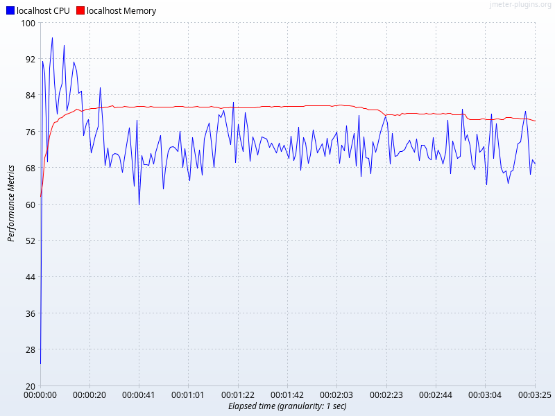
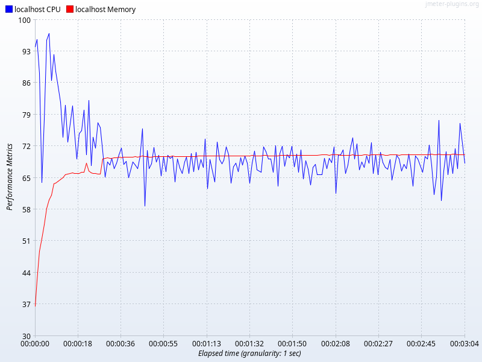

性能测试报告_sbt3.0vs4.0
=====

# 一、背景与环境

## 1.1 双方的实现
比较的双方的技术实现:
1. java17 + sbt3.0(http-nio) + mybatis + mysql
2. java25 + sbt4.0(虚拟线程) + mybatis + mysql

其中，sbt3.0 显式配置了tomcat线程池，但都是默认值:
```yml
server:
  tomcat:
    threads:
      # 最大工作线程数,默认200
      max: 200
      # 最小工作线程数,默认10
      min-spare: 10
    # 最大可处理连接数,默认8192
    max-connections: 8192
    # 请求缓冲队列最大长度,默认100
    accept-count: 100
```

而 sbt4.0 则开启了虚拟线程支持:
```yml
spring:
  threads:
    virtual:
      enabled: true
```

springboot4使用java25并开启虚拟线程，不会发生线程固定(pinned)。

## 1.2 测试环境
- 数据库: 本地机器
- web服务器: 本地机器
- 客户机: 本地机器 + Jmeter(限制使用8个小核CPU)
- 网络环境: 千兆交换机，千兆网线

本地机器:
- CPU : 12th Gen Intel(R) Core(TM) i7-12700H 20核(6大8小)
- 内存 : 32G
- OS : Deepin 23.1
- jmeter : 5.1.1


## 1.3 压力指标
- 并发线程数: 5000
- 测试时长: 3min


## 1.4 测试接口
- 全表查询: 查询一个件数1000的单表


# 二、测试结果


| project | 样本 | 平均值 | 中位数 | 90% 百分位 | 95% 百分位 | 99% 百分位 | 最小值 | 最大值 | 异常 % | 吞吐量 | 接收 KB/sec | 标准偏差 |
| --- | --- | --- | --- | --- | --- | --- | --- | --- | --- | --- | --- | --- |
| sbt3.0 | 164032 | 5581 | 893 | 17762 | 20697 | 24111 | 5 | 49727 | 0.00% | 792.1 | 249884.7 | 7273.51 |
| sbt4.0 | 166245 | 5328 | 931 | 16772 | 19064 | 21252 | 4 | 43005 | 0.00% | 897.1 | 283004.6 | 6742.99 |


条件查询测试期间，sbt3.0的资源统计(吞吐量最大的那次):



条件查询测试期间，sbt4.1的资源统计(吞吐量最大的那次):




从目前的结果上看，使用虚拟线程且避免线程固定后，springboot的性能有提升但不大。
> 吞吐量略高，响应时间略短，资源消耗略少。
